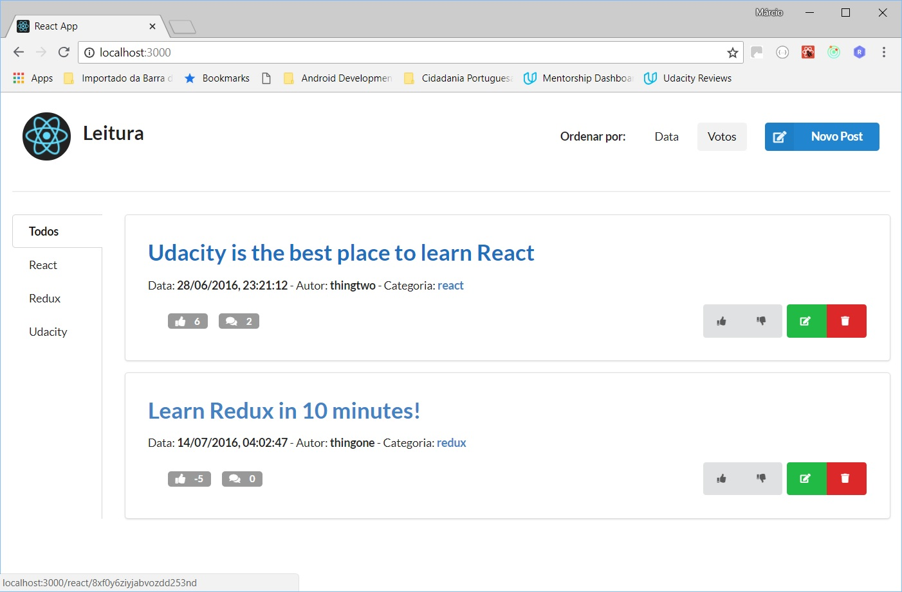
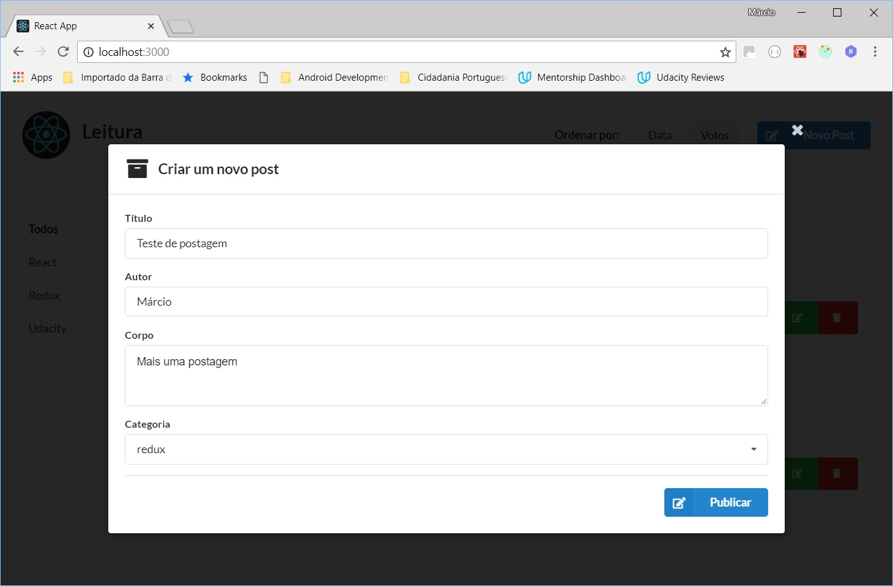
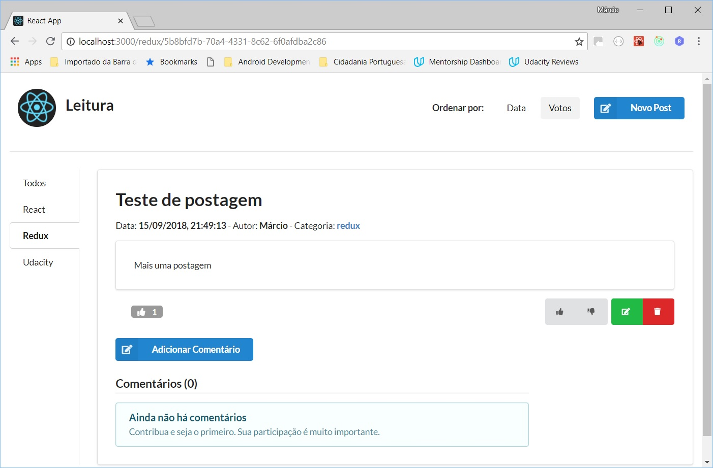
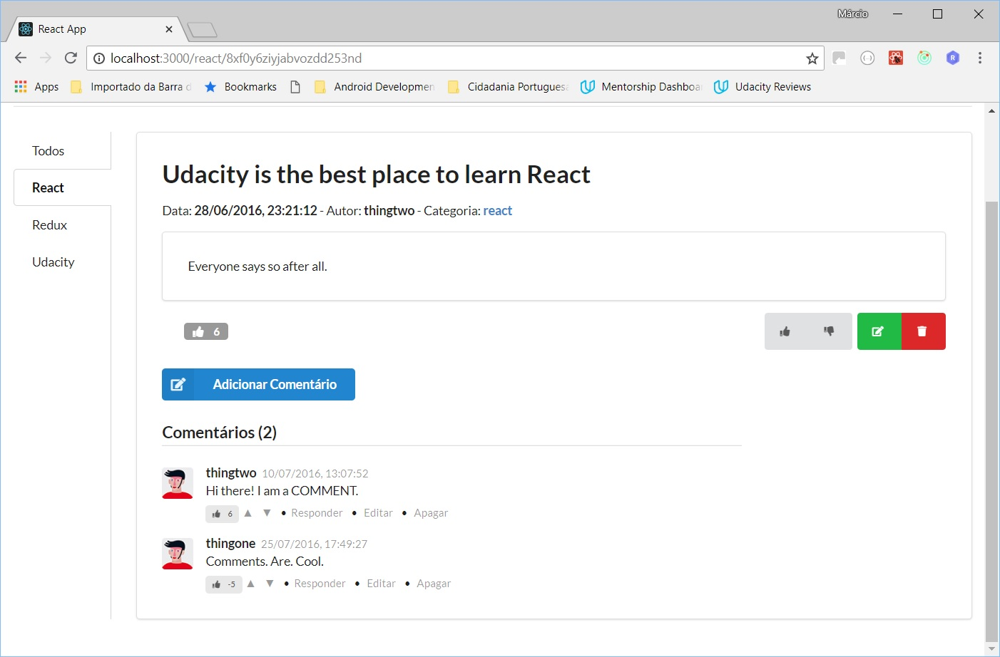
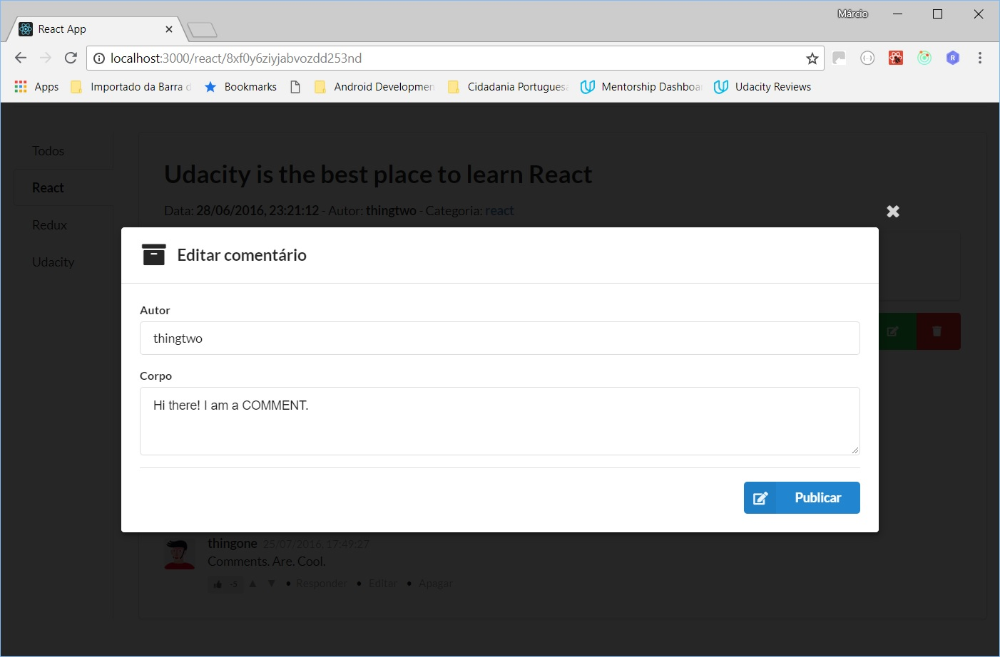
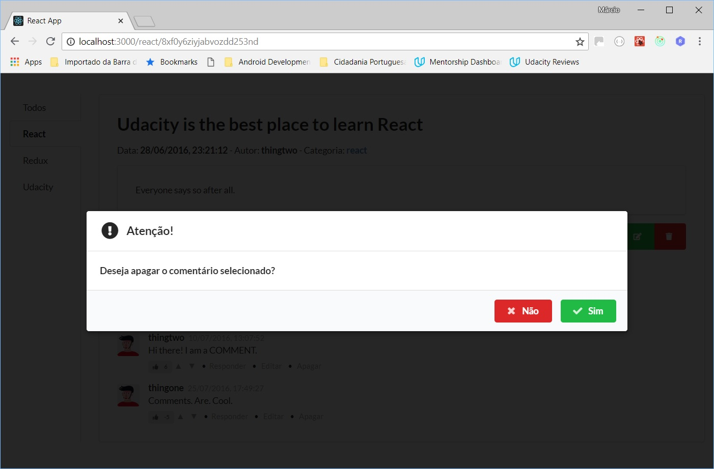

# Udacity React Nanodegree - Projeto 2 (Leitura)

Neste projeto temos um aplicativo web de conteúdo e comentários que permitirá que os usuários postem conteúdo em categorias pré-definidas, façam comentários em suas próprias postagens e nas de outros usuários e votem nas postagens e comentários. Os usuários poderão editar e excluir postagens e comentários.

O front-end deverá iteragir com a API de um servidor backend local, desenvolvido em [Node](https://nodejs.org/en/), usando seus endpoints.

**Imagens:**

<table align="center">
  <tr>
     <td>
       
       <p align="center">Tela Inicial</p>
     </td>
     <td>
       
       <p align="center">Criação de um post</p>
     </td>
  </tr>
  <tr>
     <td>
       
       <p align="center">Post criado</p>
     </td>
     <td>
       
       <p align="center">Post com comentários</p>
     </td>
  </tr>
  <tr>
     <td>
       
       <p align="center">Edição de um comentário</p>
     </td>
     <td>
       
       <p align="center">Remoção de um comentário</p>
    </td>
  </tr>
</table>

## Instalação:

* Faça um clone do repositório
* Instale e inicialize o backend
    - `cd api-server`
    - `npm install`
    - `node server`
* Em outra janela de terminal, instale e inicialize o front-end
    - `cd frontend`
    - `npm install`
    - `npm start`


## API do Backend

Informações sobre a API do backend podem ser encontradas em seu arquivo [README](api-server/README.md).


## Create React App

Este projeto foi gerado com [Create React App](https://github.com/facebookincubator/create-react-app). Mais informações [aqui](https://github.com/facebookincubator/create-react-app/blob/master/packages/react-scripts/template/README.md).

## Semantic UI React

A interface do usuário deste projeto foi desenvolvida com o framework [Semantic UI React](https://react.semantic-ui.com/).

## Jest e Enzyme

Este projeto possui testes unitários implementados com [Jest](https://jestjs.io/) e [Enzyme](https://airbnb.io/enzyme/).

Para executálos, abra outra janela de terminal e rode:
- `cd frontend`
- `npm test`
- `npm test -- --coverage` (comando opcional para ver a cobertura atual dos testes)
    
A cobertura atual se encontra em 80,33% das linhas de código:
```
---------------------------|----------|----------|----------|----------|-------------------|
File                       |  % Stmts | % Branch |  % Funcs |  % Lines | Uncovered Line #s |
---------------------------|----------|----------|----------|----------|-------------------|
All files                  |     75.8 |    81.08 |    65.63 |    80.33 |                   |
 src                       |     3.45 |        0 |        0 |     6.45 |                   |
  index.js                 |        0 |        0 |        0 |        0 |... 10,12,14,21,27 |
  registerServiceWorker.js |        0 |        0 |        0 |        0 |... 36,137,138,139 |
  setupTests.js            |      100 |      100 |      100 |      100 |                   |
 src/actions               |    94.26 |    88.46 |    96.55 |    96.61 |                   |
  index.js                 |    94.26 |    88.46 |    96.55 |    96.61 |       41,42,46,47 |
 src/components            |    82.69 |    95.96 |    66.67 |    82.47 |                   |
  App.js                   |        0 |      100 |        0 |        0 |       34,38,56,57 |
  CategoryMenu.js          |     62.5 |      100 |       40 |     62.5 |          45,49,50 |
  CommentEdit.js           |      100 |      100 |      100 |      100 |                   |
  DeletionModal.js         |      100 |      100 |      100 |      100 |                   |
  HeaderMenu.js            |    63.64 |      100 |       50 |    63.64 |       79,83,84,85 |
  Post.js                  |    76.19 |      100 |    64.29 |    76.19 |... 59,160,161,162 |
  PostDetails.js           |       80 |    82.35 |    73.08 |    79.07 |... 21,222,223,224 |
  PostEdit.js              |    96.88 |    97.83 |     87.5 |    96.88 |               229 |
  PostList.js              |    88.89 |      100 |       80 |    88.89 |                44 |
 src/reducers              |      100 |      100 |      100 |      100 |                   |
  index.js                 |      100 |      100 |      100 |      100 |                   |
 src/utils                 |    71.95 |       50 |     4.17 |    71.95 |                   |
  ServerAPI.js             |    41.03 |       50 |        0 |    41.03 |... 80,83,84,87,94 |
  constants.js             |      100 |      100 |      100 |      100 |                   |
  helpers.js               |      100 |      100 |      100 |      100 |                   |
  mockStore.js             |      100 |      100 |      100 |      100 |                   |
---------------------------|----------|----------|----------|----------|-------------------|
```
## Copyright

Esse projeto foi desenvolvido por Márcio Souza de Oliveira e o código do backend local foi disponibilizado pela Udacity.
